  Quiz de fisíca:
- Esse quiz contém 10 perguntas de fisica, quando comete erros o quiz volta para o inicio, assim que acaba você pode reiniciar e até desafiar seus amigos a fazerem também.
  
  Aula de mobile, programação de apps.

  App usado:
  -***MIT app inventor***, esse site é muito bom para programar aplicativos, tem o aplicativo dele no app da play story (MIT app inventor), Mas o aplicativo é somente para testar o aplicativo que você fez pelo site.

  Link para o site do quiz:
  -https://ai2.appinventor.mit.edu/#6614022628638720

  Quiz by:
  -Steffany giovanna da Silva Souza (3des-ds-Jc),
  -Maria Luiza Alves Florêncio (3des-ds-Jc).

  Páginas:

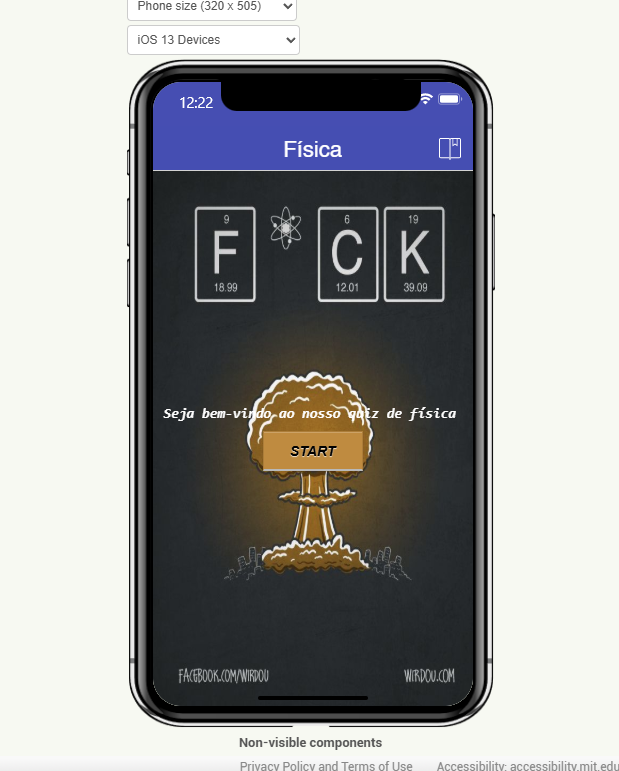
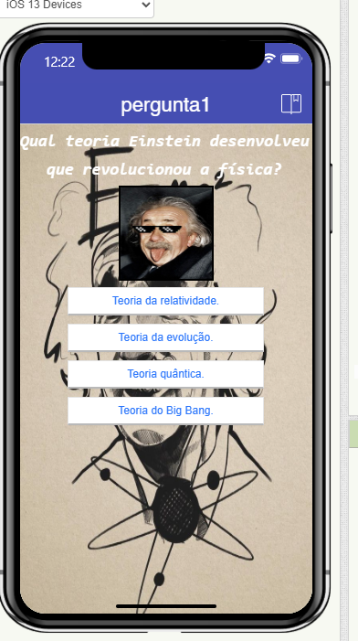
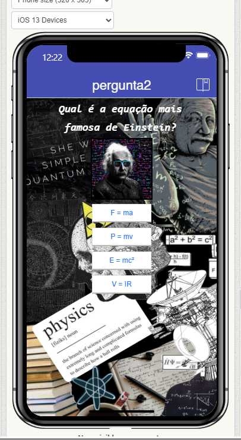

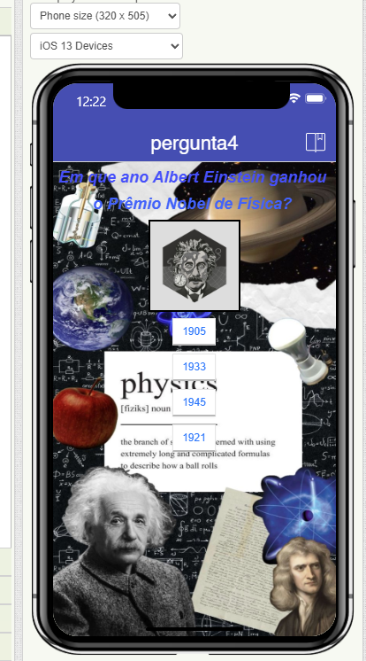
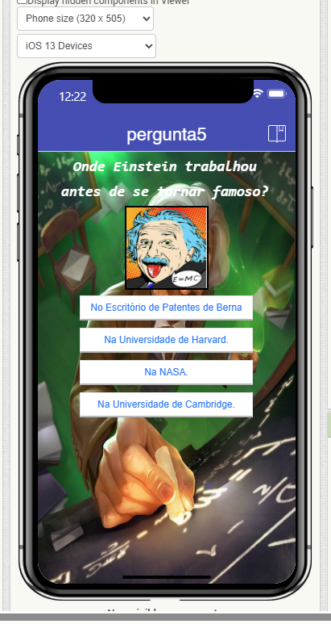
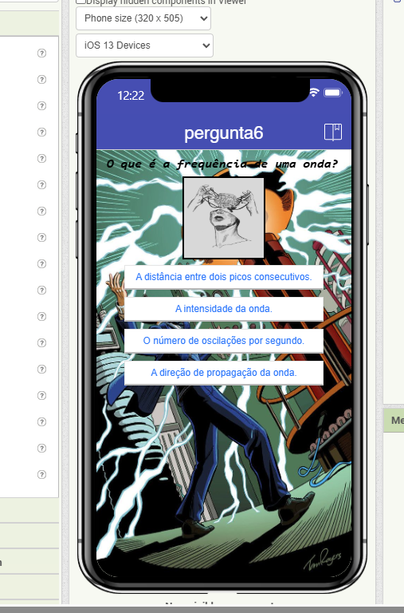
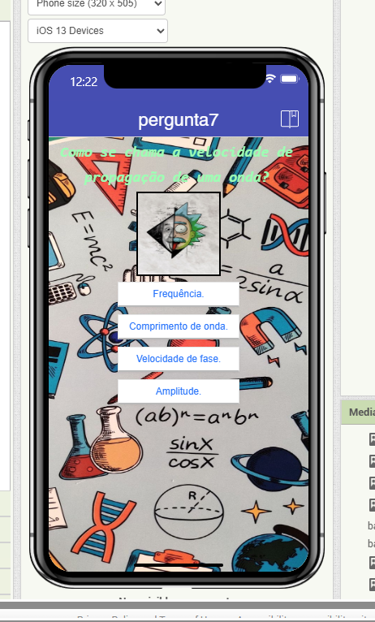
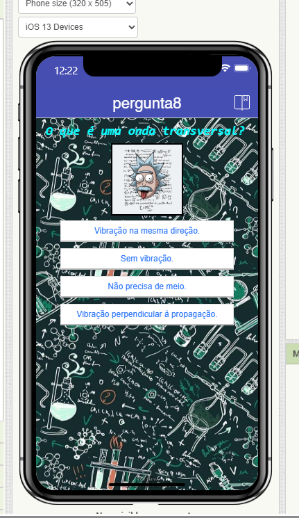
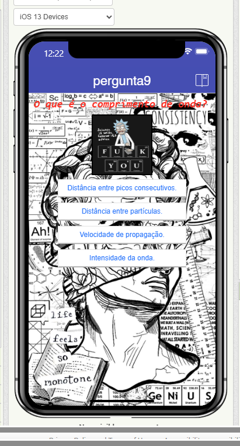
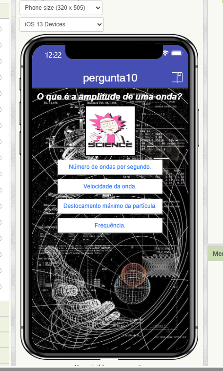
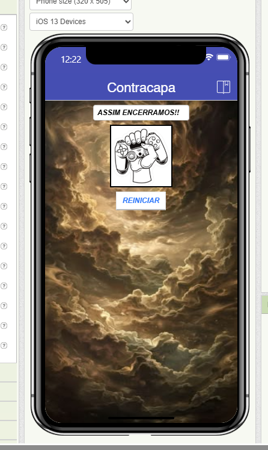
